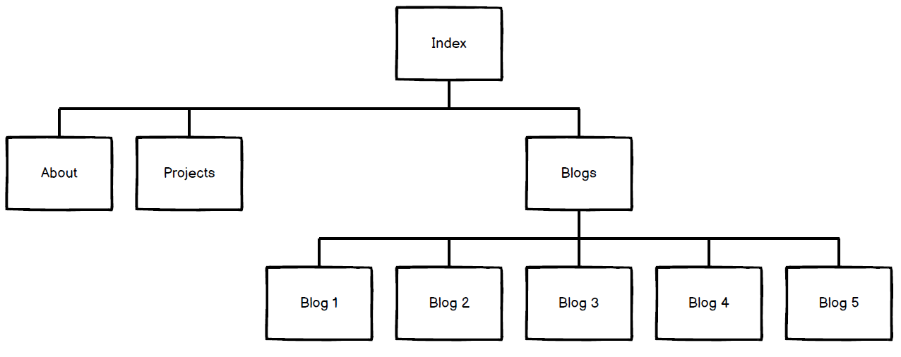
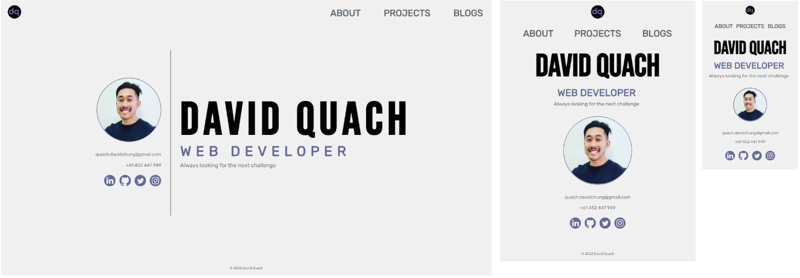
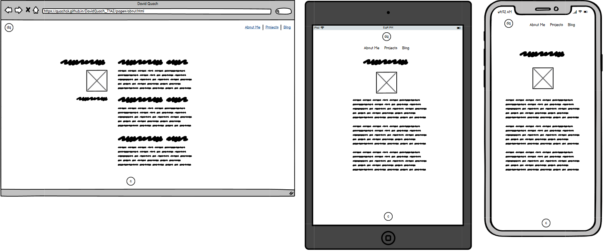
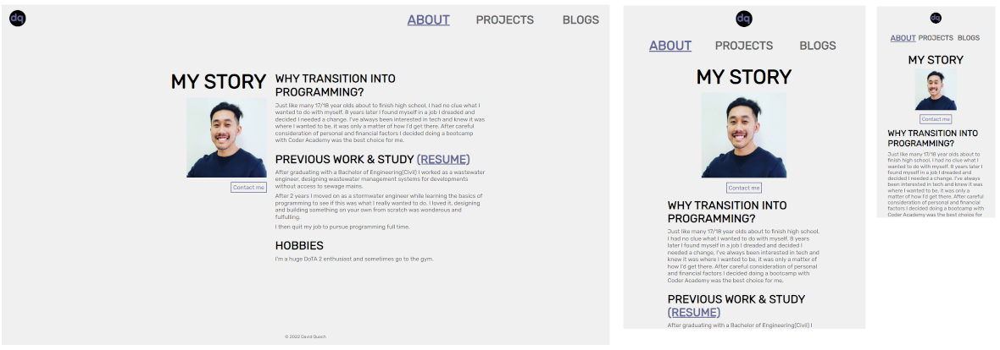
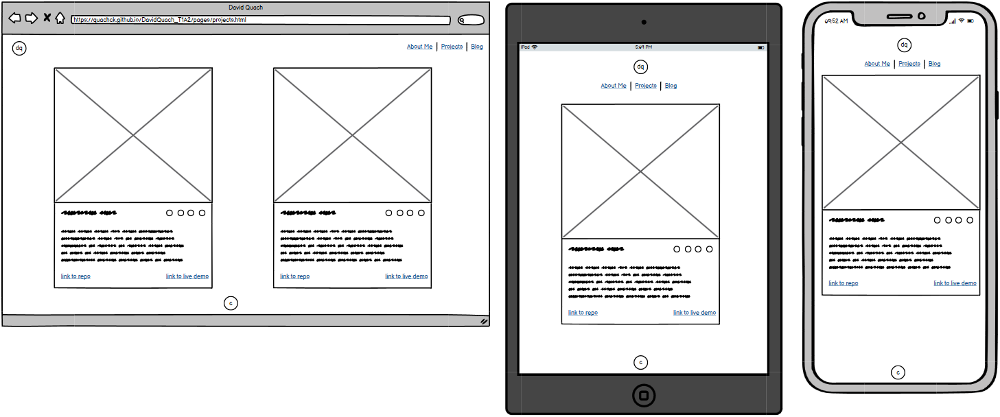
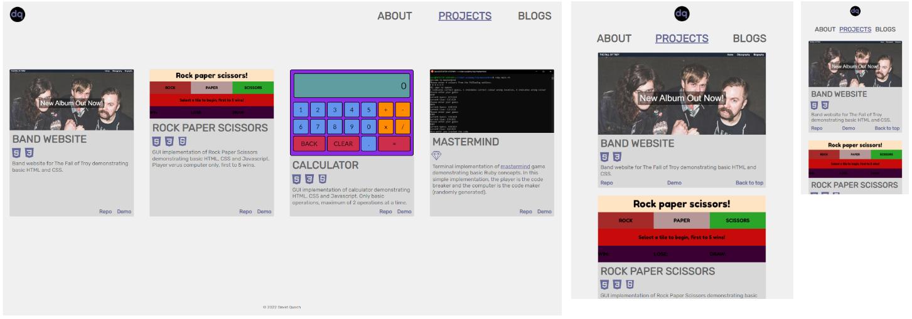
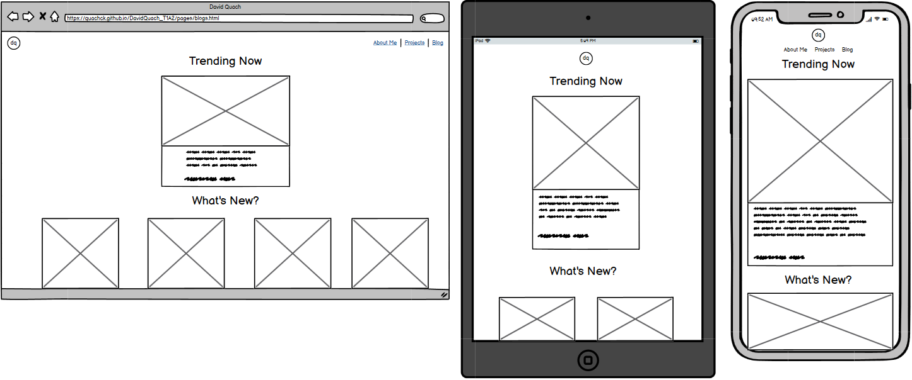
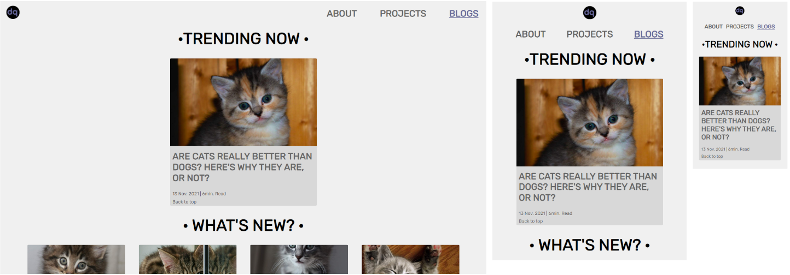
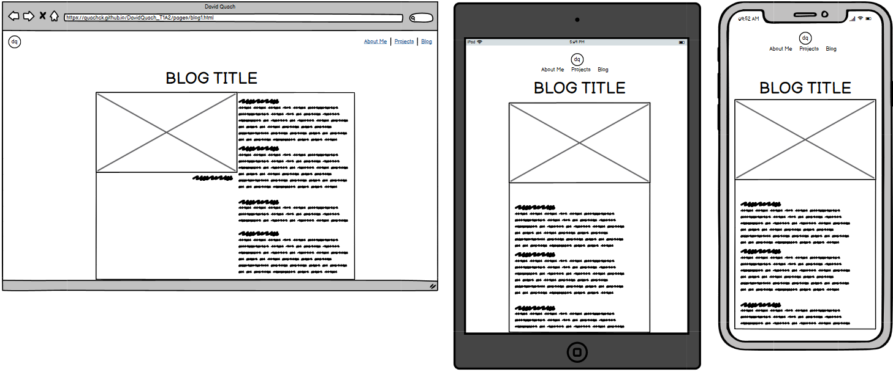
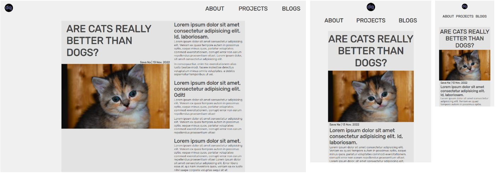

# Portfolio Documentation

---

## [Portfolio Website](https://quachck.github.io/DavidQuach_T1A2/)

## [Github Repo](https://github.com/quachck/DavidQuach_T1A2)

---

## Purpose and Target Audience

The portfolio website showcases my background, projects and capabilities and was designed with the aim of attracting engagement from prospective employers in the IT field.

---

## Functionality/Features
The website is fully semantic, accessible and respsonsive between mobile, tablet and desktop screens. It has a simple, minimalistic theme with limited but meaningful usage of colour and animation to effectively draw the users' attention to the information conveyed. It features 4 pages: 

- Index/home: Introductory page showing what I feel is the most important information - my name, portrait, aspirations, contact information and links to professional and social accounts.
- About: Page displaying my personal story, past study and work history and hobbies and interests.
- Projects: Page to showcase my past projects and as a result, skillset and technology competency.
- Blogs - Page that includes links to 5 additional blog post pages. 

---

## Sitemap
Created using Balsamiq Wireframes.

---

## Wireframes/Screenshots

### Index page:

### About page:

### Projects page:

### Blogs page:

### Blog post page:

---

## Technology Stack

- Wireframes/sitemap: Balsamiq Wireframes
- Image editing: GIMP
- Image optimisation: Image Optimiser
- Colour contrast checker: WebAIM Contrast Checker
- Website: HTML5 & CSS3
- Deployment: Github Pages

