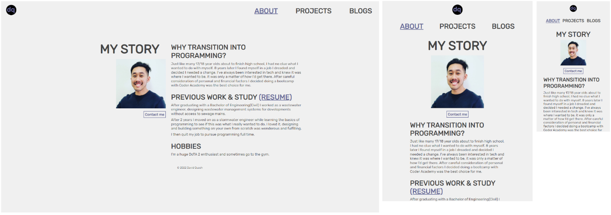
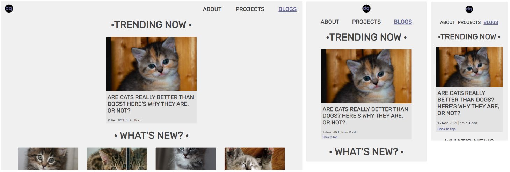

# Portfolio Documentation

## [Portfolio website](https://quachck.github.io/DavidQuach_T1A2/)

## [Github repo](https://github.com/quachck/DavidQuach_T1A2)

## Purpose and target audience

The portfolio website showcases my background, projects and capabilties and was designed with the aim of attracting engagement from employers in the IT field.

## Functionality / features
The website is semantic, accessible and fully respsonive between mobile, tablet and desktop screens. It features 4 pages: home, about, projects and blogs - which also links to 5 additional blog post pages. Each page uses semantic HTML and responsive components to display the relavent information to the user. 

## Sitemap

## Screenshots

### Index page:

### About page:

### Projects page:

### Blogs page:

### Blog post page:

## Technology stack

HTML5 and CSS3 were used to create the website which was then deployed via Github.
